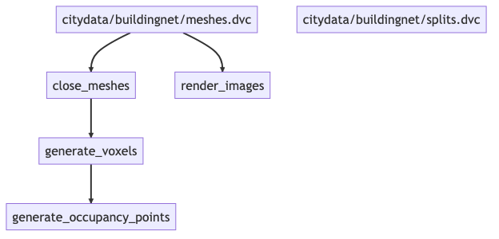

# text2building_data



This repository contains code to generate the data used by the [sibling repo](https://github.com/maxdumas/Clip-Forge/tree/main) for
this project.

## Installation

```
pip install -r requirements.txt
```

You will also need to have Docker installed to run
[`cuda_voxelizer`](https://github.com/maxdumas/cuda_voxelizer). You will also
need to compile and make available
[ManifoldPlus](https://github.com/hjwdzh/ManifoldPlus) in the `bin` folder.

Finally, you will need to obtain access to a dataset of meshes. Existing
artifacts can be pulled using `dvc pull` if you have access to the existing
artifact repository S3 bucket at `s3://cornell-mfd64/dvc/text2building_data_2`.
Contact the owner of this repository to receive access.

If you have access, all generated artifacts can be directly downloaded instead of generated, using the following command:

```
dvc pull
```

## Generating new data

If you are unable to obtain access to the artifact repository, the code here can
be used to generate new artifacts from a custom dataset. Simply populate
`citydata/buildingnet/meshes` with any number of OBJ meshes, and run the following command:

```
dvc repro
```

This will compute all artifacts according to the DAG illustrated above.

# TODO
* [] Dockerize ManifoldPlus
* [] Make pipeline more generic to other datasets

